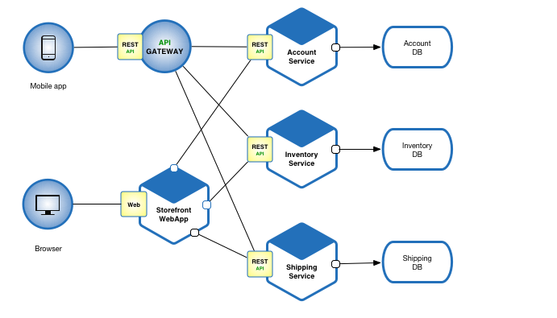
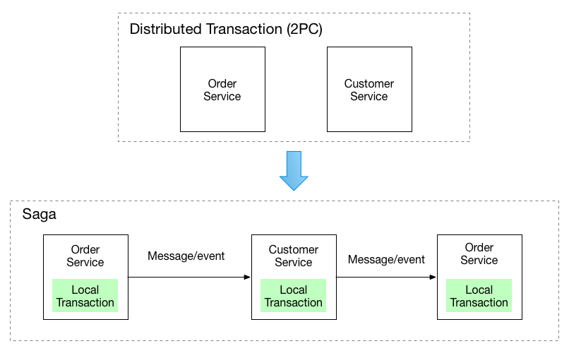
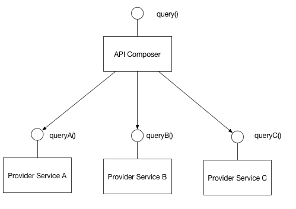

# Microsserviços

### Oque é?
* São uma abordagem de arquitetura na qual o software é composto de pequenos serviços independentes que se comunicam entre si e são organizados de acordo com seus dominios de negocio

##### link do site em qual foi baseado esse estudo: https://microservices.io
### Caracterisiticas
* Cada serviço pode ser desenvolvido,escalado e implatado sem interferir em outros serviços.
  
* A comunicação ocorre por meio de chamadas as APIs (sincronas) ou de forma assincrona.

* Cada serviço é desenhado para resolver um problema especifico
  * exemplo: Um microserviço para cadastro de usuario, outro para pagamentos, entre outros.
  * **Obs**: Se começar a ser necessário ter outras responsabilidades, é indicado que se crie um novo serviço.
* A independência dos serviços faz com que se algum deles tiver algum problema, só afetará determinada parte do fluxo.

### Boas praticas
* **Estabilidade:**
  * A Estabilidade de um microserviço ocorre quando ele não apresenta instabilidade no ecossitema de microserviços no qual faz parte, quando faz algum deploy, inclui alguma nova tecnologia ou desativa algum outro serviço.
* **Confiabilidade:**
  * Um microserviço que retorna os resultados esperados em tempo ábil e sempre estará de pé.
  * Quando tem um ciclo de desenvolvimento padronizado.
    * Quando possui code review entre outros.
  * Quando o código é submetido a testes de unidade, integração, e2e, regras de coverage(Estudar sobre).
  * Quando possui clientes conhecidos, clientes seriam serviços que o consomem.
* **Tolerância a falhas:**
  * Não pode existir uma parte do ecossitema de microserviços que uma falha possa parar todo o fluxo.
  * Não pode haver uma microserviço individual que tenha a capacidade de derrubar o ecossistema todo quando ele falhar.
  * Para avaliar se um microserviço pode ser considerado tolerante a falhas, ele é testado por meio de **testes de carga e teste de caos**.
    * Esses testes são muito aplicados antes de grandes eventos como a black Friday por exemplo, para testar a resistência da aplicação.
  * Deve haver um procedimento padrão para tratar incidentes dentro das equipes.
* **Monitoramento:**
  * Possibilita acompanhar o que está acontecento e o que ja aconteceu com seus microserviços.
  * O logging reflete com precisão os estados passados do microserviço. (Verificar qual seria esse nivel de precisão)
  * Os dashboards devem ser fáceis de interpretar e possuir todas as métricas principais.
    * Métricas: Taxa de erro, requisição vinda para cada endpoint.
  * Possuir bons alertas, avisar alguem da equipe quando algo der errado.
  * Os logs devem conter somente informações relevantes, mas não dados sensiveis.
* **Documentação:**
  * Possibilita que qualquer usuario daquele microserviço possa saber sua funcionalidade atráves da leitura da documentação.
  * Uma boa documentação é considerada aquela que é atualizada frequentemente e contém uma descrição da responsabilidade daquele microserviço como citado anteriormente.
  * **Estrutura para uma boa documentação:**
    * Conter um diagrama de arquitetura;
    * contato das pessoas responsaveis;
    * guia de bordo de desenvolvimento;
    * collections;
    * Faq;

### Padrões de microsserviços
* **Arquitetura monolitica:**
  * Arquitetura na qual utiliza somente um serviço que se responsabiliza por toda a aplicação. Esse tipo de arquitetura é bom para desenvolver mais rapido e implantar mais rapido, porém mais complicado para resolver possiveis problemas, por ser responsável por diversas funcionalidades.
  *  **Obs:** Os microserviços tem a função de dividir essas responsabilidades em diversos micro serviços tendo cada um uma responsabilidade especifica. Nesse tipo de arquitetura pode-se escalar algumas partes separadas.
* **Decompose by business capability:**
  * Decomposição de uma aplicação monolitica que acabou crescendo demais para microsserviços.
  * Requisitos:
    * A arquitetura deve ser estável;
    * Serviços devem ser coesos;
    * serviços devem ser fracamente acoplados;
    * Serviços devem ser testáveis;
* **Decompose by subdomain:**
  * É separado por dominio de ordem.
  

### Padrões de refatoração
* **Strangler application:**
  * Desenvolve uma nova aplicação em volta da anterior para "estrangular o monolito".
* **Camada de anticorrupção:**
  * Define uma camada de anticorrupção que se traduz entre os dois modelos de dominio, serve para evitar que o modelo de dominio de um monolito polua o dominio do novo serviço.

### Padrões de gerenciamento de dados
* Em sistemas distribuidos é importante garantir a consitência dos dados, que estejam com os valroes corretos e que nenhum dado se perca.
* **Saga** (Estudar)
  

* **Api composition:**
  * Implementar uma consulta definindo um API consumer, que invoca os serviços que possuem os dados e executa uma junção na memória dos resultados.
  

* **CQRS**(Command Query Responsibility Segregator):
  * Resolve o problema de como Implementar uma consulta que recupera dados de varios serviços em uma arquitetura de microserviços.
  * Ele define um banco de dados somente para leitura, sendo uma replica do "oficial", mantendo essa replica atualizada por meio de eventos.
* **APIs externas**:
  * Como os clientes de uma aplicação baseada em microserviços ira acessar serviços individuais?
    * Implementando um API gateway que seja o unico ponto de entrada para todos os clientes.

### Observabilidade
* **Agregação de logs:**
  * Para entender o comportamento de um aplicativo, é preciso criar um log centralizado de cada instância do serviço, podendo as pessoas usuárias pesquisar, analisar e configurar alertas.
    * Exemplos: Cloud Watch, datadog, new relic, entre outros.
* **Distributed tracing:**
  * Para entender também o comportamento de um aplicativo, é preciso usar serviços como o sleuth, que atribuem um id unico para cada requisição e passa esse id em todos os logs da requisição.
* Comunicação:
  * Nenhum microserviço existe sozinho.
  * Utiliza REST ou GRPC.
  * Mensageria:
    * Como os microserviços podem se comunicar de forma assincrona.
    * Utiliza Kafka, Rabit ou SQS.

### Conclusão
#### A arquitetura de microserviços ajuda muito na organização do aplicativo, sendo de suma importância desenvolve-los seguindo as boas práticas, fazendo sempre melhorias, e avaliar quais patterns fazem sentido para o seu ecossistema.